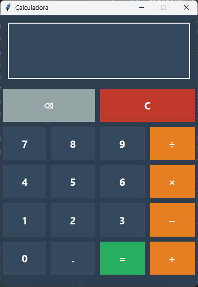

# Calculadora

Uma calculadora simples e bonita feita em Python.



## O que faz

- Soma, subtração, multiplicação e divisão
- Interface moderna com cores bonitas
- Funciona com o mouse ou teclado
- Botão para apagar só um número
- Mostra "Erro" quando algo corre mal

## Como usar

### Com o mouse:
1. Clica nos números
2. Clica na operação que queres (+, -, ×, ÷)
3. Clica no segundo número
4. Clica "=" para ver o resultado
5. Usa "C" para limpar tudo ou "⌫" para apagar só o último

### Com o teclado:
- Números e operações normalmente
- Enter para calcular
- Backspace para apagar
- Escape para limpar tudo

## Para executar

Precisas de ter Python instalado.

Depois é só fazer duplo clique no ficheiro `calculadora.py` ou escrever no terminal:
```
python calculadora.py
```

## Melhorias feitas

- Design mais moderno com cores escuras
- Botões com efeito quando passas o rato por cima
- Símbolos matemáticos bonitos (× ÷ −)
- Suporte para usar o teclado
- Botão para apagar só um caractere
- Números decimais sem zeros desnecessários

## Próximas ideias

- Mais operações (potência, percentagem)
- Histórico dos cálculos
- Modo claro/escuro