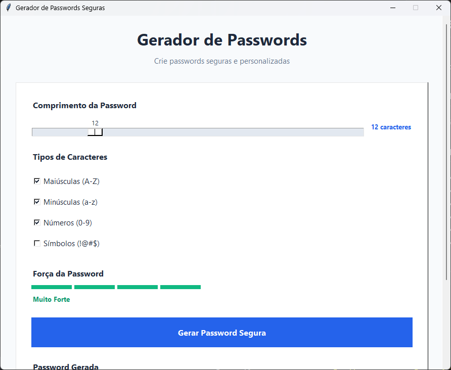

# Gerador de Passwords

Um programa simples para criar passwords seguras.



## O que faz

- Cria passwords com o tamanho que quiseres (de 4 a 50 caracteres)
- Podes escolher que tipos de letras e números usar
- Mostra se a password é forte ou fraca
- Copia a password automaticamente
- Interface simples de usar

## Como usar

1. Escolhe o tamanho da password
2. Marca as opções que queres (maiúsculas, minúsculas, números, símbolos)
3. Clica em "Gerar Password"
4. Copia a password ou cria uma nova

## Para executar

Precisas de ter Python instalado no computador.

Depois é só fazer duplo clique no ficheiro `password_generator.py` ou abrir o terminal e escrever:
```
python password_generator.py
```

## Sobre o código

Usei ajuda de IA para fazer o design mais bonito e organizar melhor o código. O objetivo foi aprender a fazer interfaces gráficas em Python de forma mais rápida, mas sempre percebendo como funciona cada parte.

## Melhorias futuras

- Guardar histórico das passwords (sem mostrar as passwords)
- Mais opções de personalização
- Tema escuro